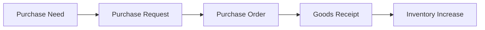
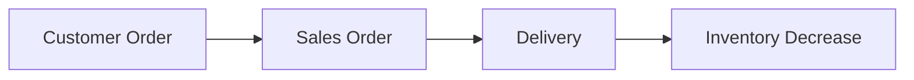
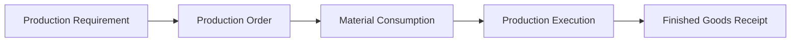
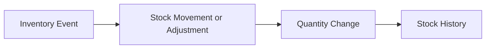

# As-Is Process Flows

The following four flows are clean-room **analytical starting models**. They organize representative capabilities into plausible sequences; they do not confirm that every step, arrow, status transition, or inventory effect existed in a historical system. Confirmed case facts are limited to the fictional business context, selected modules, and migration target described in the case context.

## A. Purchasing

### Known / Working Model

The working model connects an internal purchase need to a request, supplier order, physical receipt, and inventory increase. It provides a traceability frame for analyzing request-to-receipt behavior.

### Assumptions

- A purchase request may precede a purchase order.
- A goods receipt may reference a purchase order.
- Receipt processing may trigger or authorize an inventory increase.
- Approval points, partial quantities, tolerances, and cancellation paths are not established.

### Migration Questions

- Is a purchase request mandatory for all purchase orders?
- Can a goods receipt be partial or exceed the purchase-order quantity?
- At which receipt state should inventory increase?

## B. Sales

### Known / Working Model

The working model connects customer demand to an internal sales order, delivery activity, and an inventory decrease. It is a basis for analyzing order-to-delivery visibility.

### Assumptions

- A customer order is represented internally by a sales order.
- Delivery may be linked to one sales order.
- Delivery processing may trigger or authorize an inventory decrease.
- Reservation, allocation, shipment confirmation, and partial fulfillment behavior are not established.

### Migration Questions

- Does an accepted sales order reserve stock?
- Can one sales order be fulfilled through multiple deliveries?
- What should happen when available stock is insufficient?

## C. Manufacturing

### Known / Working Model

The working model connects a production requirement with an authorized order, component consumption, execution, and recorded output. A bill of materials may inform the expected inputs but does not by itself confirm consumption quantities.

### Assumptions

- Production work is represented by a production or work order.
- Component usage and production output affect inventory at defined transaction stages.
- Finished goods may require a receipt or completion event before they appear in stock.
- Backflushing, scrap handling, overproduction, and quality controls are not established.

### Migration Questions

- When should components be deducted from inventory?
- Can actual consumption differ from the bill of materials?
- Can reported production output exceed the planned quantity?

## D. Inventory Adjustment / Movement

### Known / Working Model

The working model represents a generic inventory event—such as a transfer, physical-count variance, or authorized correction—as a controlled transaction that changes quantity and leaves a history record.

### Assumptions

- Quantity changes should be associated with a source event and responsible user.
- Transfers and adjustments may require different controls even if both affect stock.
- Stock history may provide cross-module traceability.
- Approval thresholds, negative-stock rules, and transfer-in-transit behavior are not established.

### Migration Questions

- Which inventory events require approval before posting?
- Can an adjustment create negative inventory?
- Does an inter-warehouse transfer require separate dispatch and receipt confirmation?
