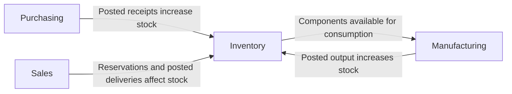

# Mini System Requirements Document

## 1. Document Purpose

This Mini System Requirements Document defines a testable V1 baseline for the fictional Northstar Components Manufacturing browser-based ERP. It traces the selected legacy analysis and stakeholder decisions into business rules and functional requirements. It is not a complete ERP specification and does not reproduce any real internal system.

## 2. Case Background

Northstar Components Manufacturing is a fictional mid-sized industrial-component manufacturer migrating from a difficult-to-maintain desktop ERP toward an integrated browser-based system. Sprint 1 reconstructed representative legacy capabilities and open questions as clean-room working models. Sprint 2 treats the selected entries in the [Stakeholder Decision Baseline](06-stakeholder-decision-baseline.md) as the sole source of Northstar-specific V1 behavior.

Approved and active item/material, supplier, customer, warehouse/location, unit-of-measure, user, and role records are assumed to exist. Their detailed maintenance workflows are outside this document.

## 3. Scope

### In Scope

- Purchasing: Purchase Request, Purchase Order, receipt, and order-remainder handling.
- Sales: confirmation, stock reservation, delivery, and outstanding-quantity visibility.
- Inventory: receipt posting, adjustments, warehouse transfers, stock position, and transaction history.
- Manufacturing: Production Order states, actual consumption, production output, and inventory effects.
- Permissions and traceability: fixed role-based actions and audit records for quantity changes.

### Out of Scope

- Finance and accounting detail
- Tax
- Customer relationship management
- Human resources
- Advanced material requirements planning
- Forecasting
- Mobile applications
- Third-party integrations
- Complex pricing
- Quality-management systems
- Advanced approval matrices
- Emergency purchasing
- Automated replenishment and backorder orchestration
- Sales-return inspection and disposition
- Approved overproduction and tolerance workflows

## 4. Actors

| Actor | V1 Responsibility |
|---|---|
| Purchasing Staff | Creates Purchase Requests and Purchase Orders within granted permissions and monitors purchasing progress. |
| Sales Staff | Creates and confirms Sales Orders and monitors allocation and delivery progress. |
| Warehouse Staff | Posts Goods Receipts, deliveries, stock adjustments, transfers, consumption, and production results when authorized. |
| Production Staff | Progresses Production Orders and records actual consumption and output for authorized posting. |
| Manager / Approver | Approves controlled transactions and explicitly closes eligible outstanding quantities when authorized. |
| System Administrator | Assigns fixed action permissions to roles and supports access administration; the role does not imply authority to perform every business transaction. |

## 5. Target Process Overview

The target connects the three operational flows through shared inventory quantities and transaction history. The diagram shows integration direction, not every status or user action.

The V1 lifecycle states used by the requirements are deliberately limited:

- Purchase Order: `OPEN` → `PARTIALLY RECEIVED` → `RECEIVED`, with explicit `CLOSED` for an authorized outstanding remainder.
- Sales Order: `CONFIRMED` → `PARTIALLY DELIVERED` → `DELIVERED`.
- Inventory Transfer: `DRAFT` → `DISPATCHED / IN TRANSIT` → `RECEIVED`.
- Production Order: `PLANNED` → `RELEASED` → `IN PROGRESS` → `COMPLETED`.

## 6. Business Rules

The following rules express reusable decision logic rather than screen behavior. All are approved only for this fictional V1 baseline.

| Business Rule ID | Rule |
|---|---|
| BR-PUR-001 | A Goods Receipt quantity posted against a Purchase Order line must not exceed that line's remaining ordered quantity. |
| BR-PUR-002 | Posting a Goods Receipt increases item on-hand quantity and reduces the Purchase Order line's remaining quantity by the posted quantity. A Purchase Order with both received and outstanding quantities is `PARTIALLY RECEIVED`; one with no outstanding quantity is `RECEIVED`; an authorized user may explicitly set an order with an outstanding remainder to `CLOSED`. |
| BR-SAL-001 | Confirming a Sales Order may reserve no more than the currently available item quantity. Requested quantity above that amount remains unallocated. |
| BR-SAL-002 | A posted Delivery must not exceed the Sales Order line's outstanding quantity. A Sales Order with both delivered and outstanding quantities is `PARTIALLY DELIVERED`; one with no outstanding quantity is `DELIVERED`. |
| BR-SAL-003 | Posting a Delivery decreases item on-hand quantity and its related reservation by the posted delivered quantity; an unposted Delivery changes neither quantity. |
| BR-INV-001 | A stock adjustment requires a creator, reason, approver, and posting user and timestamp. Posting is blocked if the resulting on-hand quantity would be negative. |
| BR-INV-002 | An Inventory Transfer moves from `DRAFT` to `DISPATCHED / IN TRANSIT` and then `RECEIVED`. Dispatch decreases source on-hand quantity; receipt increases destination on-hand quantity. |
| BR-INV-003 | Every posted quantity-changing transaction creates a persistent inventory-history record containing source document ID, transaction type, timestamp, responsible user, signed quantity change, affected item, and source or destination location when relevant. |
| BR-MFG-001 | A Production Order progresses only through `PLANNED`, `RELEASED`, `IN PROGRESS`, and `COMPLETED` in that order for the V1 happy path. |
| BR-MFG-002 | Posting actual material consumption decreases component on-hand quantity by the posted actual amount and records both the applicable Bill of Materials quantity and the resulting variance. V1 defines no variance-authorization tiers. |
| BR-MFG-003 | Cumulative posted production output must not exceed the Production Order's planned quantity. V1 blocks excess output; approved overproduction support is deferred. |
| BR-MFG-004 | Posting a Production Result increases finished-item on-hand quantity by the posted output. When cumulative posted output equals planned quantity, the Production Order becomes `COMPLETED`. |
| BR-SYS-001 | A user may perform a controlled `create`, `approve`, `post`, or `cancel` action only when the user's assigned role grants that action for the target module. |

## 7. Functional Requirements

### Purchasing

### FR-PUR-001 — Create a Purchase Order from an Approved Request

- **Actor:** Purchasing Staff
- **Preconditions:** Active supplier, item, unit, and destination location records exist; an approved Purchase Request has an outstanding quantity; the actor has Purchasing `create` permission.
- **Requirement:** When the actor creates a Purchase Order for standard inventory purchasing, the system shall require a reference to the approved Purchase Request and shall prevent an ordered quantity above the request's outstanding quantity.
- **Postconditions:** The Purchase Order is saved as `OPEN`; the referenced request and ordered quantity are retained for traceability; inventory is unchanged.
- **Business Rules:** BR-SYS-001
- **Source Decision:** OQ-PUR-001
- **Legacy Capability:** LEG-PUR-001, LEG-PUR-002
- **Priority:** MUST
- **Status:** APPROVED — FICTIONAL V1 BASELINE

### FR-PUR-002 — Post a Partial or Complete Goods Receipt

- **Actor:** Warehouse Staff
- **Preconditions:** An `OPEN` or `PARTIALLY RECEIVED` Purchase Order has remaining quantity; the actor has Purchasing `post` permission.
- **Requirement:** When the actor posts a positive Goods Receipt quantity not greater than the Purchase Order line's remaining quantity, the system shall reduce the remaining quantity and increase destination on-hand inventory by the posted quantity.
- **Postconditions:** The receipt is posted; the order becomes `PARTIALLY RECEIVED` when a remainder exists or `RECEIVED` when none exists; an inventory-history record is created.
- **Business Rules:** BR-PUR-001, BR-PUR-002, BR-INV-003, BR-SYS-001
- **Source Decision:** OQ-PUR-002, OQ-INV-001, OQ-SYS-004
- **Legacy Capability:** LEG-PUR-002, LEG-PUR-003, LEG-INV-001, LEG-INV-002
- **Priority:** MUST
- **Status:** APPROVED — FICTIONAL V1 BASELINE

### FR-PUR-003 — Block Receipt Above Remaining Quantity

- **Actor:** Warehouse Staff
- **Preconditions:** An `OPEN` or `PARTIALLY RECEIVED` Purchase Order line has a known remaining quantity; the actor attempts to post a Goods Receipt.
- **Requirement:** If the receipt quantity is greater than the line's remaining quantity, the system shall reject posting and identify that the remaining ordered quantity would be exceeded.
- **Postconditions:** The receipt remains unposted; Purchase Order quantities, statuses, inventory, and inventory history are unchanged.
- **Business Rules:** BR-PUR-001
- **Source Decision:** OQ-PUR-003
- **Legacy Capability:** LEG-PUR-003
- **Priority:** MUST
- **Status:** APPROVED — FICTIONAL V1 BASELINE

### FR-PUR-004 — Explicitly Close an Outstanding Purchase Order Remainder

- **Actor:** Manager / Approver
- **Preconditions:** A Purchase Order is `OPEN` or `PARTIALLY RECEIVED` with an outstanding quantity; the actor has Purchasing `cancel` permission.
- **Requirement:** When the actor explicitly closes the outstanding remainder, the system shall set the Purchase Order to `CLOSED`, retain ordered, received, and unreceived quantities, and prevent further receipts against it.
- **Postconditions:** The outstanding quantity is no longer receivable; prior receipts and inventory quantities are unchanged; the closure actor and timestamp are retained.
- **Business Rules:** BR-PUR-002, BR-SYS-001
- **Source Decision:** OQ-PUR-004, OQ-SYS-001
- **Legacy Capability:** LEG-PUR-002, LEG-PUR-006
- **Priority:** SHOULD
- **Status:** APPROVED — FICTIONAL V1 BASELINE

### Sales

### FR-SAL-001 — Confirm a Sales Order and Reserve Available Stock

- **Actor:** Sales Staff
- **Preconditions:** Active customer, item, unit, and fulfillment-location records exist; the Sales Order has a positive requested quantity; the actor has Sales `approve` permission.
- **Requirement:** When the actor confirms the Sales Order, the system shall set it to `CONFIRMED`, reserve the lesser of requested quantity and currently available quantity, and record any remainder as unallocated.
- **Postconditions:** Reserved and unallocated quantities are visible per order line; on-hand quantity is unchanged.
- **Business Rules:** BR-SAL-001, BR-SYS-001
- **Source Decision:** OQ-SAL-001, OQ-SYS-001
- **Legacy Capability:** LEG-SAL-001, LEG-INV-001, LEG-INV-006
- **Priority:** MUST
- **Status:** APPROVED — FICTIONAL V1 BASELINE

### FR-SAL-002 — Post a Partial Delivery

- **Actor:** Warehouse Staff
- **Preconditions:** A `CONFIRMED` or `PARTIALLY DELIVERED` Sales Order has reserved and outstanding quantity; the actor has Sales `post` permission.
- **Requirement:** When the actor posts a positive Delivery quantity that does not exceed both reserved and outstanding quantity, the system shall reduce on-hand, reserved, and outstanding quantities by the delivered quantity.
- **Postconditions:** The Delivery is posted; the order is `PARTIALLY DELIVERED` when an outstanding remainder exists or `DELIVERED` when none exists; inventory history is created.
- **Business Rules:** BR-SAL-002, BR-SAL-003, BR-INV-003, BR-SYS-001
- **Source Decision:** OQ-SAL-002, OQ-SYS-004
- **Legacy Capability:** LEG-SAL-001, LEG-SAL-002, LEG-INV-001, LEG-INV-002, LEG-INV-006
- **Priority:** MUST
- **Status:** APPROVED — FICTIONAL V1 BASELINE

### FR-SAL-003 — Block Delivery Above Reserved or Outstanding Quantity

- **Actor:** Warehouse Staff
- **Preconditions:** A Delivery references a `CONFIRMED` or `PARTIALLY DELIVERED` Sales Order; reserved and outstanding quantities are known.
- **Requirement:** If the Delivery quantity exceeds either the reserved quantity or the Sales Order line's outstanding quantity, the system shall reject posting and identify the limiting quantity.
- **Postconditions:** The Delivery remains unposted; order quantities, statuses, inventory, reservations, and inventory history are unchanged.
- **Business Rules:** BR-SAL-002, BR-SAL-003
- **Source Decision:** OQ-SAL-001, OQ-SAL-002
- **Legacy Capability:** LEG-SAL-001, LEG-SAL-002, LEG-INV-006
- **Priority:** MUST
- **Status:** APPROVED — FICTIONAL V1 BASELINE

### FR-SAL-004 — Show Fulfillment Quantities and State

- **Actor:** Sales Staff
- **Preconditions:** A Sales Order exists.
- **Requirement:** The system shall show requested, reserved, unallocated, delivered, and outstanding quantities per Sales Order line together with the current `CONFIRMED`, `PARTIALLY DELIVERED`, or `DELIVERED` state.
- **Postconditions:** The actor can distinguish allocated, fulfilled, and unmet demand without changing transaction data.
- **Business Rules:** BR-SAL-001, BR-SAL-002
- **Source Decision:** OQ-SAL-001, OQ-SAL-002
- **Legacy Capability:** LEG-SAL-001, LEG-SAL-005, LEG-INV-006
- **Priority:** SHOULD
- **Status:** APPROVED — FICTIONAL V1 BASELINE

### Inventory

### FR-INV-001 — Reflect Posted Purchase Receipts in Stock Position

- **Actor:** Warehouse Staff
- **Preconditions:** A Goods Receipt references a Purchase Order and destination location; the receipt has not been posted.
- **Requirement:** When the Goods Receipt is posted, the system shall increase the affected item's on-hand quantity at the destination location exactly once by the posted receipt quantity; saving or viewing an unposted receipt shall not change on-hand quantity.
- **Postconditions:** The updated stock position equals the prior on-hand quantity plus the receipt quantity; its history record references the Goods Receipt.
- **Business Rules:** BR-PUR-002, BR-INV-003
- **Source Decision:** OQ-INV-001, OQ-SYS-004
- **Legacy Capability:** LEG-PUR-003, LEG-INV-001, LEG-INV-002
- **Priority:** MUST
- **Status:** APPROVED — FICTIONAL V1 BASELINE

### FR-INV-002 — Approve and Post a Valid Stock Adjustment

- **Actor:** Warehouse Staff
- **Preconditions:** The adjustment has an item, location, non-zero signed quantity, creator, and reason; a role-authorized Manager / Approver has approved it; the actor has Inventory `post` permission.
- **Requirement:** When the actor posts an approved adjustment whose resulting on-hand quantity is zero or greater, the system shall apply the signed quantity once and retain creator, reason, approver, posting user, and posting timestamp.
- **Postconditions:** On-hand quantity reflects the adjustment; the adjustment is posted and immutable as a pending transaction; inventory history is created.
- **Business Rules:** BR-INV-001, BR-INV-003, BR-SYS-001
- **Source Decision:** OQ-INV-002, OQ-SYS-001, OQ-SYS-004
- **Legacy Capability:** LEG-INV-001, LEG-INV-002, LEG-INV-004
- **Priority:** MUST
- **Status:** APPROVED — FICTIONAL V1 BASELINE

### FR-INV-003 — Block a Negative-Stock Adjustment

- **Actor:** Warehouse Staff
- **Preconditions:** An approved stock adjustment would reduce the item's location-level on-hand quantity below zero; the actor attempts to post it.
- **Requirement:** The system shall reject posting and identify that the adjustment would produce negative on-hand inventory.
- **Postconditions:** The adjustment remains unposted; on-hand quantity and inventory history are unchanged.
- **Business Rules:** BR-INV-001
- **Source Decision:** OQ-INV-002
- **Legacy Capability:** LEG-INV-001, LEG-INV-004
- **Priority:** MUST
- **Status:** APPROVED — FICTIONAL V1 BASELINE

### FR-INV-004 — Dispatch an Inter-Warehouse Transfer

- **Actor:** Warehouse Staff
- **Preconditions:** A `DRAFT` transfer identifies different active source and destination locations, an item, and a positive quantity not greater than source on-hand; the actor has Inventory `post` permission.
- **Requirement:** When the actor dispatches the transfer, the system shall change its state to `DISPATCHED / IN TRANSIT`, decrease source on-hand quantity by the transfer quantity, and leave destination on-hand quantity unchanged.
- **Postconditions:** The quantity is identifiable as in transit; a source inventory-history record is created; the transfer cannot be dispatched again.
- **Business Rules:** BR-INV-002, BR-INV-003, BR-SYS-001
- **Source Decision:** OQ-INV-004, OQ-SYS-001, OQ-SYS-004
- **Legacy Capability:** LEG-INV-001, LEG-INV-002, LEG-INV-003
- **Priority:** MUST
- **Status:** APPROVED — FICTIONAL V1 BASELINE

### FR-INV-005 — Receive an Inter-Warehouse Transfer

- **Actor:** Warehouse Staff
- **Preconditions:** A transfer is `DISPATCHED / IN TRANSIT`; the actor has Inventory `post` permission.
- **Requirement:** When the actor receives the transfer, the system shall change its state to `RECEIVED` and increase destination on-hand quantity once by the dispatched transfer quantity without further changing source on-hand quantity.
- **Postconditions:** The quantity is no longer in transit; a destination inventory-history record is created; the transfer cannot be received again.
- **Business Rules:** BR-INV-002, BR-INV-003, BR-SYS-001
- **Source Decision:** OQ-INV-004, OQ-SYS-001, OQ-SYS-004
- **Legacy Capability:** LEG-INV-001, LEG-INV-002, LEG-INV-003
- **Priority:** MUST
- **Status:** APPROVED — FICTIONAL V1 BASELINE

### Manufacturing

### FR-MFG-001 — Progress a Production Order Through V1 States

- **Actor:** Production Staff
- **Preconditions:** A Production Order references an active item and positive planned quantity; the actor has Manufacturing permission for the requested transition.
- **Requirement:** The system shall allow an authorized actor to move the order from `PLANNED` to `RELEASED` and from `RELEASED` to `IN PROGRESS`; it shall reject attempts to skip a state. Only posting the Production Result that brings cumulative output to planned quantity shall move an `IN PROGRESS` order to `COMPLETED`.
- **Postconditions:** An accepted release or start state and responsible user are retained; rejected transitions leave the state unchanged; completion follows FR-MFG-004.
- **Business Rules:** BR-MFG-001, BR-MFG-004, BR-SYS-001
- **Source Decision:** OQ-MFG-004, OQ-SYS-001
- **Legacy Capability:** LEG-MFG-003, LEG-MFG-005
- **Priority:** MUST
- **Status:** APPROVED — FICTIONAL V1 BASELINE

### FR-MFG-002 — Post Actual Material Consumption

- **Actor:** Production Staff
- **Preconditions:** The Production Order is `IN PROGRESS`; an applicable Bill of Materials quantity and a positive actual consumption quantity are recorded; sufficient component on-hand exists; the actor has Manufacturing `post` permission.
- **Requirement:** When the actor posts consumption, the system shall decrease component on-hand by the actual quantity and retain the Bill of Materials quantity, actual quantity, and signed variance. V1 shall not require a variance-tolerance approval tier.
- **Postconditions:** Consumption is posted once; component stock is reduced; inventory history references the Production Order and consumption transaction.
- **Business Rules:** BR-MFG-002, BR-INV-003, BR-SYS-001
- **Source Decision:** OQ-MFG-001, OQ-SYS-001, OQ-SYS-004
- **Legacy Capability:** LEG-MFG-001, LEG-MFG-003, LEG-MFG-004, LEG-INV-001, LEG-INV-002
- **Priority:** MUST
- **Status:** APPROVED — FICTIONAL V1 BASELINE

### FR-MFG-003 — Block Production Output Above Planned Quantity

- **Actor:** Production Staff
- **Preconditions:** A Production Result references an `IN PROGRESS` Production Order with known planned and cumulative posted output quantities.
- **Requirement:** If the proposed output would make cumulative posted output greater than planned quantity, the system shall reject posting and identify the Production Order's remaining planned quantity.
- **Postconditions:** The result remains unposted; Production Order state, output totals, finished-item inventory, and inventory history are unchanged.
- **Business Rules:** BR-MFG-003
- **Source Decision:** OQ-MFG-003
- **Legacy Capability:** LEG-MFG-003, LEG-MFG-006
- **Priority:** MUST
- **Status:** APPROVED — FICTIONAL V1 BASELINE

### FR-MFG-004 — Post Production Output and Complete the Order

- **Actor:** Production Staff
- **Preconditions:** A Production Result references an `IN PROGRESS` Production Order; proposed positive output does not exceed remaining planned quantity; the actor has Manufacturing `post` permission.
- **Requirement:** When the actor posts the Production Result, the system shall increase finished-item on-hand by the posted quantity and add it to cumulative posted output. If cumulative output equals planned quantity, the system shall set the Production Order to `COMPLETED`; otherwise it shall remain `IN PROGRESS`.
- **Postconditions:** Output is posted once; finished-item stock and order totals are updated; inventory history references the Production Result and Production Order.
- **Business Rules:** BR-MFG-003, BR-MFG-004, BR-INV-003, BR-SYS-001
- **Source Decision:** OQ-MFG-003, OQ-MFG-004, OQ-SYS-001, OQ-SYS-004
- **Legacy Capability:** LEG-MFG-003, LEG-MFG-005, LEG-MFG-006, LEG-INV-001, LEG-INV-002
- **Priority:** MUST
- **Status:** APPROVED — FICTIONAL V1 BASELINE

### System / Permission

### FR-SYS-001 — Enforce Fixed Role Permissions for Controlled Actions

- **Actor:** System Administrator
- **Preconditions:** Active users and roles exist; each role has defined module-level `create`, `approve`, `post`, and `cancel` grants.
- **Requirement:** For every controlled action, the system shall allow the action only when the current user's assigned role grants the corresponding action for that module; otherwise it shall reject the action and leave transactional state unchanged.
- **Postconditions:** Authorized actions may continue to their business-rule validation; rejected actions make no transaction or inventory change.
- **Business Rules:** BR-SYS-001
- **Source Decision:** OQ-SYS-001
- **Legacy Capability:** LEG-MST-006
- **Priority:** MUST
- **Status:** APPROVED — FICTIONAL V1 BASELINE

### FR-SYS-002 — Retain Required Inventory-History Fields

- **Actor:** Warehouse Staff, Production Staff, or other authorized posting actor
- **Preconditions:** A quantity-changing Goods Receipt, Delivery, stock adjustment, transfer dispatch or receipt, material consumption, or Production Result passes authorization and business-rule validation.
- **Requirement:** When the transaction posts, the system shall create one corresponding inventory-history record containing source document ID, transaction type, posting timestamp, responsible user, signed quantity change, affected item, and source or destination location when relevant.
- **Postconditions:** The posted transaction and its history record persist with a traceable reference; failure to create the history record prevents the quantity change from being committed.
- **Business Rules:** BR-INV-003, BR-SYS-001
- **Source Decision:** OQ-SYS-001, OQ-SYS-004
- **Legacy Capability:** LEG-INV-002, LEG-MST-006 and all V1 quantity-changing capabilities
- **Priority:** MUST
- **Status:** APPROVED — FICTIONAL V1 BASELINE

## 8. Non-Functional Boundaries

- The target is accessible through supported desktop web browsers; the supported browser/version matrix requires an architectural decision.
- Authorization is role-based and must be applied before a controlled action changes transactional state.
- Blocked business-rule violations provide a validation message identifying the rule-relevant condition and leave persisted quantities and states unchanged.
- Posted transaction and inventory-history records persist and remain traceably linked.
- Performance targets, availability targets, concurrency capacity, record-retention duration, backup and recovery targets, supported deployment topology, authentication design, encryption controls, session policy, and detailed security monitoring are **DEFERRED / REQUIRES ARCHITECTURAL DECISION**.

No quantitative service level is asserted by this fictional case.

## 9. Deferred Items

- Customer-return inspection, disposition, and restocking behavior (OQ-SAL-004).
- Emergency-purchase exceptions.
- Automated replenishment and backorder orchestration for unallocated Sales Order quantity.
- Approved overproduction, output tolerances, and related approval controls; V1 blocks output above planned quantity.
- Manufacturing consumption-variance tolerance and authorization governance (OQ-MFG-002), while recording actual and Bill of Materials quantities remains in V1.
- Contextual approval matrices by value, warehouse, or item category (OQ-SYS-002).
- Master-data approval and effective dating (OQ-SYS-003).
- Detailed pricing, physical-count workflow, lot/batch traceability, advanced planning, and supplier sourcing comparison.
- Test scenarios and test cases, which belong to the next project phase.
